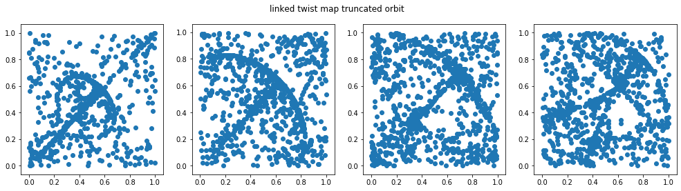
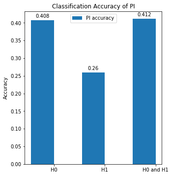

# Geometric Inference with Persistent Images

This repository contains the code and results for a project on geometric inference using Persistent Images (PIs). The project explores the use of PIs, a stable vector representation of persistent homology, for classifying data with topological features.

## Project Overview

The core idea is to represent data's underlying shape and structure using topological data analysis (TDA) techniques. Persistent homology captures the evolution of topological features (like connected components, loops) at different scales. Persistent Images then provide a vector representation of this topological information, making it suitable for machine learning tasks. This project compares PIs with Persistent Landscapes (PLs).

## Experiments

The project focuses on three key experiments to evaluate the effectiveness of Persistent Images:

### 1. Comparison of Persistent Images and Persistent Landscapes (PLs)

*   **Dataset:** A synthetic dataset consisting of six distinct shape classes represented as point clouds in 3D space:
    *   Unit Cube
    *   Circle (diameter one)
    *   Sphere (diameter one)
    *   Three clusters (randomly positioned)
    *   Hierarchical clusters
    *   Torus

*   **Methodology:**
    1.  Compute Persistent Homology (H0 and H1) for the point clouds using Vietoris-Rips filtrations.
    2.  Generate Persistent Images and Persistent Landscapes from the persistence diagrams.
    3.  Use K-Medoids clustering algorithm to classify these data.
    4.  Train the model using different distance metrics (L1, L2, Chebyshev), noise levels, homological dimensions to perform classification.
    5.  Evaluate the classification accuracy of PIs and PLs.

*   **Results:** The PI and PL models were compared and the accuracy can be observed in the chart below.


The results are then measured by time it takes to compute the classifiers.


*   **Key Observations:**:
    *   In general, both PLs and PIs had fairly close results.
    *   PIs had a slight advantage to PLs due to speed.
    *   PLs are theoretically stronger as they inherit stability features of the diagrams.

### 2. Linked Twist Map Classification

*   **Objective:** To classify data generated from a linked twist map, a discrete dynamical system.

*   **Methodology:**
    1.  Generate point clouds from the linked twist map with varying parameter values, `r = {4.1, 4.3, 4.6, 5}` .
    * 
    2.  Compute Persistent Images (H0 and H1) from these point clouds.
    3.  Train the model using a Random Forest Classifier.

*   **Results:**
    The code tests classification accuracy of concatenating both of those models.



*   **Key Observations:**. Homological information is very helpful in getting greater discriminatory power.

### 3. Effect of Parameters on PI Performance

*   **Objective:** to test how Variance and Resolution effects PI Performance, using the `fitPI` function.
*   **Methodology:**
        *   Loop through different values for variance/resolution
        *   Measure how model accuracy changes for different values
*   **Results:**


*   **Key Observations:** PI had a slight advantage to PLs due to speed. PLs are theoretically stronger as they inherit stability features of the diagrams.

## Code Structure

The repository contains the following key files:

*   `linked_twist_map.py`: Code for generating data from the linked twist map and visualizing it.
*   `topology_compare.py`: Code for comparing Persistent Images and Persistent Landscapes for classification. This file includes the main experiment logic, data loading, PH computation, PI/PL calculation, classification, and plotting.
*   `representations` - Local implementation of `Persistent Image` and `Persistent Landscape` models.

## Usage

1.  Clone the repository: `git clone [repository URL]`
2.  Install the required dependencies: `pip install -r requirements.txt`
3.  Place the all the relevant data files into the required folders `ToyData_PD_TextFiles`.
4.  Run the python files with `python` command.
5.  All the required charts will be rendered after running the file.

**requirements.txt**

```bash
gudhi
representations
numpy
pandas
scikit-learn
matplotlib
```

## Notes and Assumptions

*   Requires a module called `representations` which has the PI and PL model implementations.
*   Requires `ToyData_PD_TextFiles` folder in the current directory.
*   This is not the standard sklearn kmedoids implementation, assuming to allow some external configuration.

## Conclusion

The project demonstrates the effectiveness of Persistent Images as a tool for geometric inference and classification, as well as the advantages and disadvantages to related approaches. The results shows PIs are theoretically weaker than PLs (stability), but they can run much faster. Further research can be conducted to implement faster and stabler models that work in real-world situations.

**More details on persistent images:**  Adams, Henry, et al. "Persistence images: A stable vector representation of persistent homology." Journal of Machine Learning Research 18.8 (2017): 1-35. [See here](https://www.jmlr.org/papers/volume18/16-337/16-337.pdf)